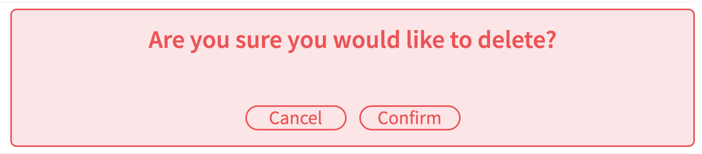
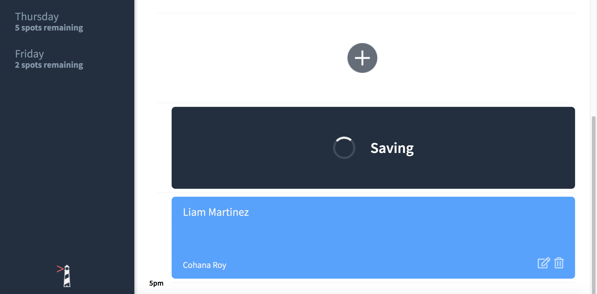

# Interview Scheduler
An React App To Schedule Interviews with mentors for each weekday. 
It keeps track of the available spots per day.
Appointments can be added, edited, or deleted.

## Setup

Install dependencies with `npm install`.

## Running Webpack Development Server

```sh
npm start
```

## Running Jest Test Framework

```sh
npm test
```

## Running Storybook Visual Testbed

```sh
npm run storybook
```
### Delete Confirmation

### Saving an new interview

### No spots left remaining

